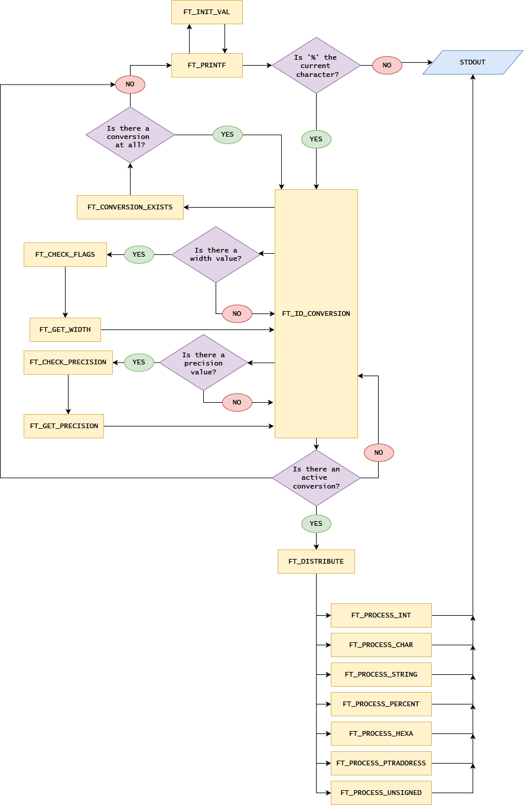

# ft_printf

This is a recoding of the printf function, made as an assignment at Escola 42 - São Paulo. It works with the c, x, X, p, i, d, s and % conversions, and with 0 and - width flags, as well as . precision values.

# How to run it

ft_printf depends on the libft function library to run. If you intend to run it, you have to clone libft as a submodule inside it. You can use my libft, or if you're a 42 student, you can use your own. If you want to do so, just replace the address on the following command with your own libft repository.

On your terminal, run:

...
git clone http://github.com/lrcouto/ft_printf.git && cd ft_printf && git clone http://github.com/lrcouto/libft.git && make
...

# Structure:

# Work history:

May 6th 2020 - Flags work for Ints. Norme is OK.

May 7th 2020 - Trying to handle exception when the program finds a '%' with no conversion afterwards. Works up to this point if there is other conversions on the main string, but if it's the last one of the string, it tends to grab random chars as if they were supposed to be conversions. Maybe try an "alphanumeric characters are not garbage" approach.

May 12th 2020 - Int and Percent tests work. Char is segfaulting and I don't know why.

May 13th 2020 - Char and Percent tests work. Need to fix hexa conversions from int to unsigned int.

May 14th 2020 - Char, String, Int, Percent and Unsigned conversions work with flags AFAIK. Having trouble with testers.

May 19th 2020 - Testing code on PFT_2019 tester (https://github.com/cclaude42/PFT_2019). Passed 622 out of 745 tests. Spent the day fixing problems with NULL parameters being input.

May 20th 2020 - Passing on all of the PFT_2019 tests. Tomorrow I will look for memory leaks and other problems of the sort.

May 21st 2020 - Fixed several memory leaks, fixed a few blatant logic errors that definitely shouldn't be there at this stage of the project, and
fixed some weird behavior that happens when you input zero precision. Testing now on the "Hello Kitty" tester (https://github.com/Mazoise/42TESTERS-PRINTF). 509 out of 514 tests passed. Will continue tomorrow.

May 22st 2020 - After spending 5 hours chasing what turned out to be a rogue null character, the code passes on both PFT_2019 and the "Hello Kitty" tester. Now all I have to do is get it through Moulinette.
